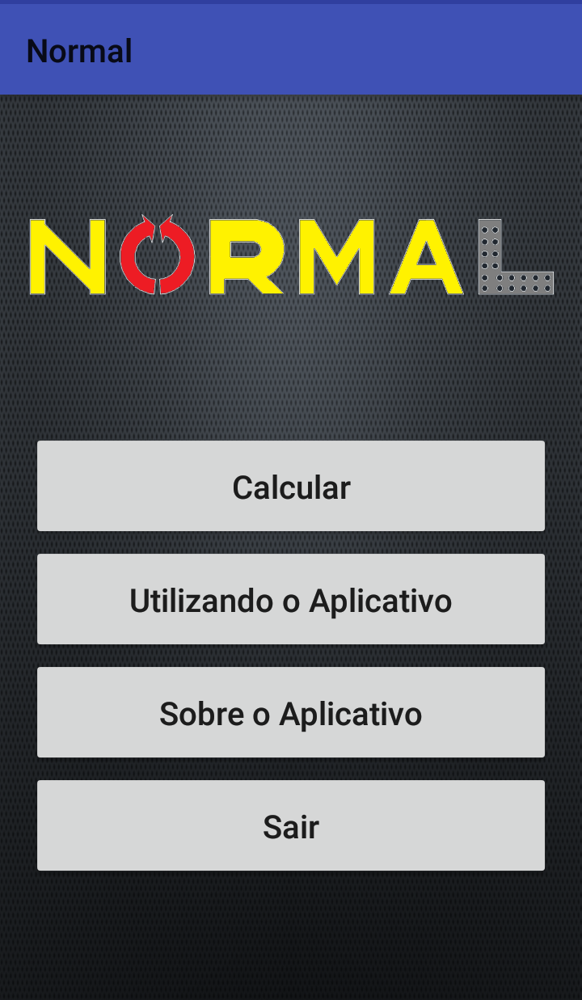
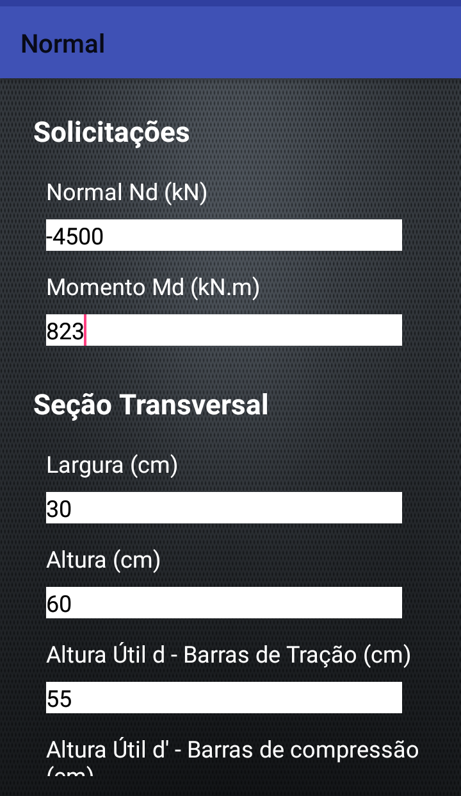
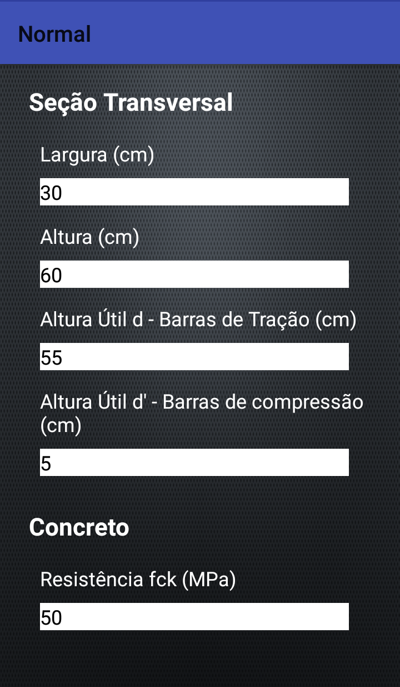
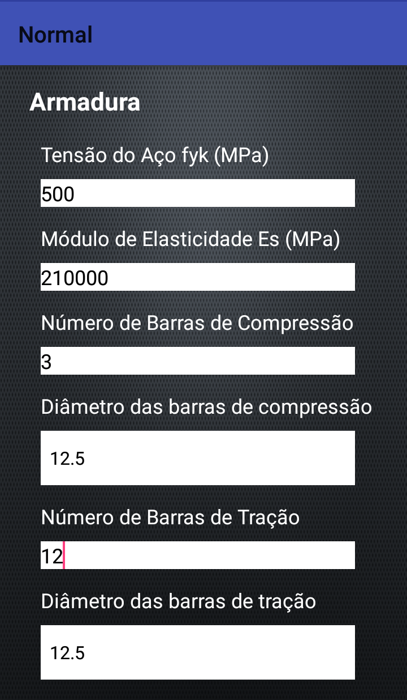
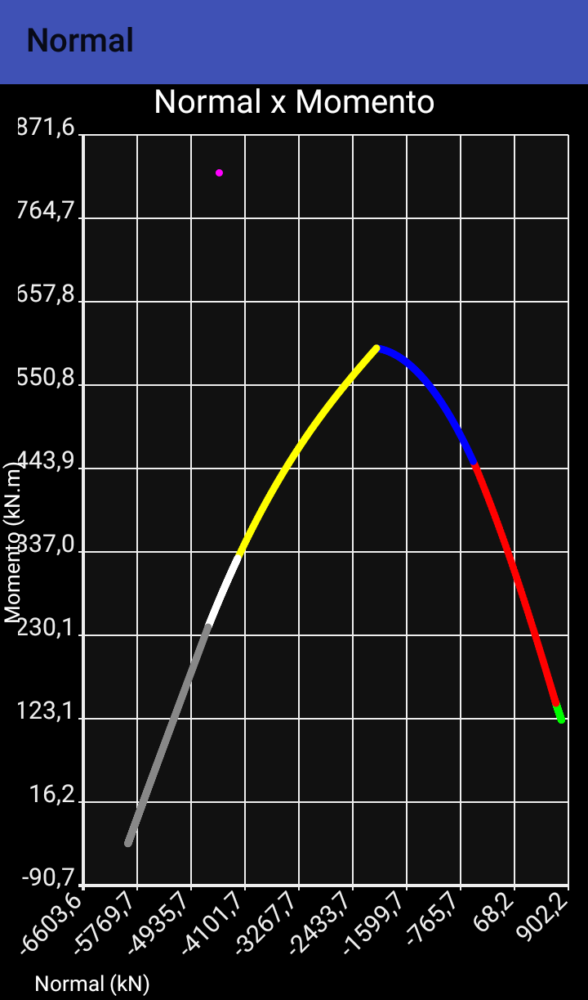
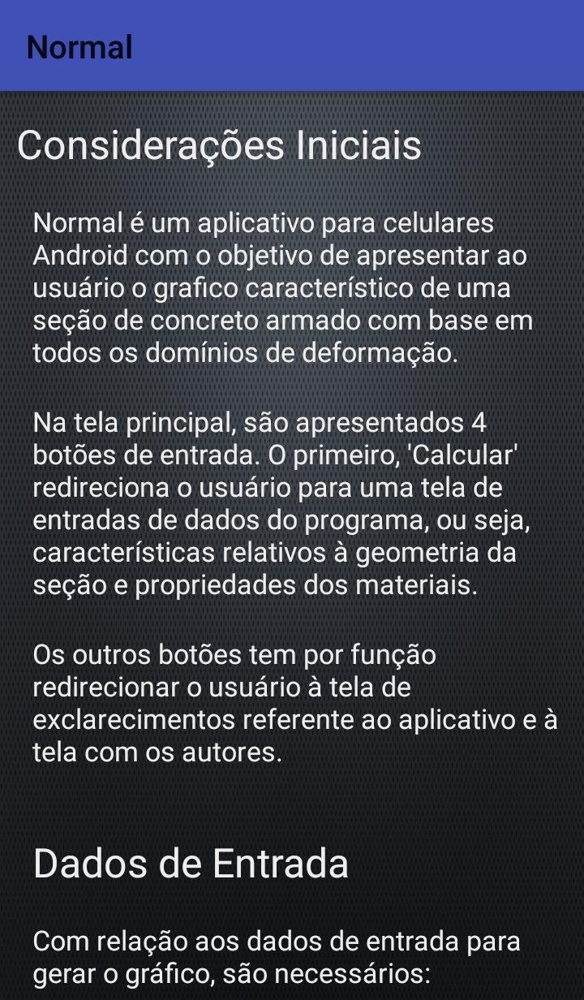
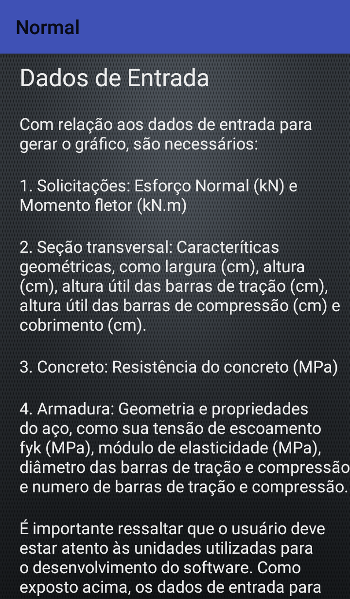
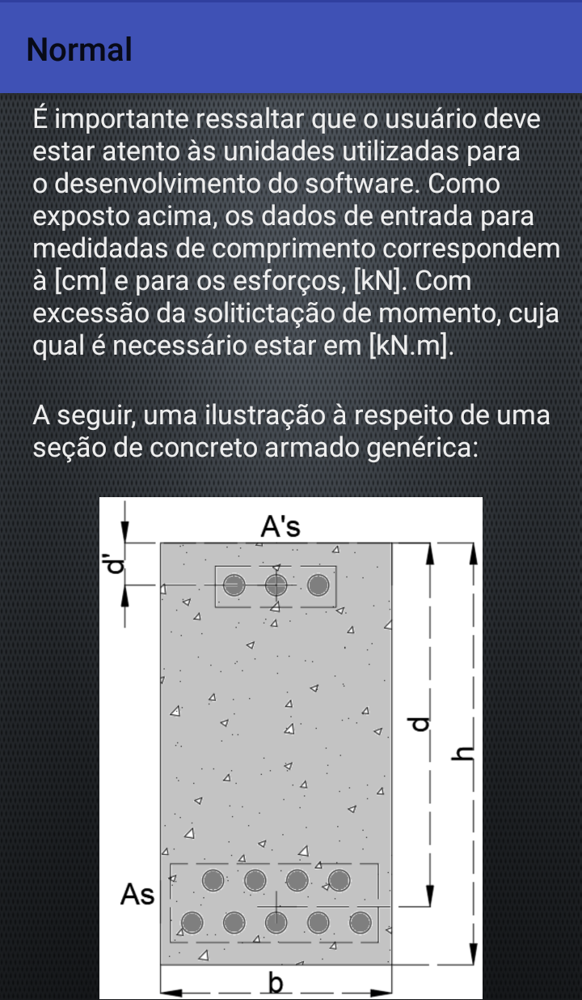

# Normal Version 1.0

## Introduction

Normal is a app for Android. This app presents a graphic with all concrete domains and the domain of the user's structure. It can be to do based on the material's characteristics (concrete and steel) and structure geometry.

## Software Normal

The software starts with a principal window, where it is possible to see some operations in their menu. There are 4 buttons: "Calcular" (calculate), "Utilizando o Aplicativo" (using app), "Sobre o Aplicativo" (about the app) and "Sair" (exit).

 <b>Figure 1:</b> Normal - Principal Window

"Calcular" (calculate) is the principal step. The App open a new window with some informations to complete: 

* Load: "Normal" (axial force, kN) and "Momento" (moment, kN.m)
* Geometry: "Largura" (width, cm), "Altura" (height, cm), "Altura útil d - Barra de tração" (useful height based on steel with tension solicitation, cm), "Altura útil d' - Barra de compressão" (useful height based on steel with compression solicitation, cm), "Resistencia fck" (concrete compression resistence, MPa), "Tensão do Aço fjk" (steel yield resistence, MPa), "Módulo de Elasticidade Es" (steel Young's Module, MPa), "Número de Barras de Compressão" (number of bars with compression load), "Diâmetro das barras de compressão" (diameter of bars with compression load), "Número de Barras de Tração" (number of bars with tension load) and "Diâmetro das barras de tração" (diameter of bars with tension load), like Figures 02 to 04:

 <b>Figure 2:</b> Normal - Section characteristics Window

Finally, press button "Resultado" (result) and a new window is opened, Figure 3. In this window, it show a graphic with all concrete's domains and where the structure is localizated. Domain 1 (grey), domain 2 (white), domain 3 (yellow), domain 4a (blue), domain 4b (red) and domain 5 (green). The structure is represented by a pink point. If the pink point is insite the domain, the structure is not collapsed. If the structure is outside, the structure is collapsed.

 <b>Figure 3:</b> Normal - Result Window

Button "Utilizando o Aplicativo" (using app) show a simple help to user about how use the app, like Figure 4.

 <b>Figure 13:</b> Normal - Using App Window

Finally, the last button "Sobre o Aplicativo" (about the app), show a informations about the institution and developers.

 <b>Figure 15:</b> Normal - About the App Window

## Informations About the Software

Rio de Janeiro State University

Faculty of Engineering

Developers: Ana Waldila de Queiroz Ramiro Reis and Alla Ribeiro Brito

Professor: Maria Fernanda Figueiredo de Oliveira

Contact: anawaldila@hotmail.com

Link for download: https://play.google.com/store/apps/details?id=uerj.normal
